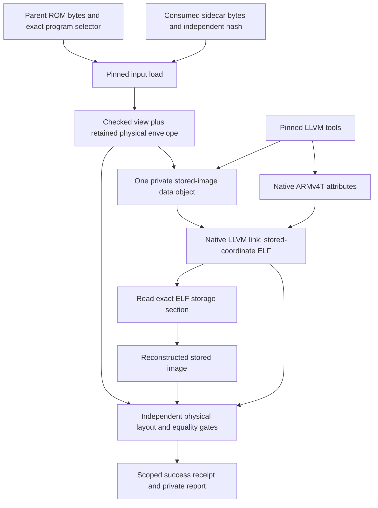

# Ownership and caller flow

## Knowledge ownership

| Location | Responsibility | Boundary |
| --- | --- | --- |
| Existing `lib/src/rom/arm7.rs` | Verify original ROM/program/header/image/parameters/table/regions; retain an immutable physical envelope | Add an immutable getter, preserving existing checked-view callers |
| Proposed `lib/src/rom/arm7_baseline_input.rs` | Consume pinned sidecar bytes, select exactly one program, produce `PinnedArm7Input` | Two input representations become one checked domain input; no mutable layout escapes |
| Proposed `lib/src/baseline/arm7_flat.rs` | Own native container construction, ELF/image/layout verification, freshness and report publication | One build operation; stages remain internal evidence, not a public orchestration API |
| Proposed thin `cli/src/cmd/arm7_flat_baseline.rs` | Read files/options, resolve reviewed tool pins, call input load then build | No duplicate image/layout arithmetic in CLI |
| Public synthetic tests and private root proof | Verify both native artifact structure and original-byte equality | Baseline report cannot imply code discovery or source matching |

The new baseline does not invoke `Init`, `Module::analyze_arm9`, `Module::new`,
`Program::from_config`, Function parsing, cross-reference analysis, LCF generation
or ARM9 `native_link.py`. Those routes interpret metadata and impose ARM9 shape.
The LLVM tools are subprocess dependencies, not new analyzed-module semantics.

## Grounded existing caller flow

At checked-view source `67e9a8b`, the existing observation example hashes layout
and span sidecar bytes before parsing them, then calls `layout.checked(parent)`
and constructs physical module inputs (`lib/examples/arm7_observation_probe.rs:
32–45`). It rereads inputs before reporting (`72–81`). The physical checker
verifies parent and selected-program hashes, header fields, image, parameter
words, region ordering/ranges and table words before constructing the view
(`lib/src/rom/arm7.rs:198–351`). That constructor drops entry/header/image/
parameter metadata when retaining only identity, startup, autoloads and table.
The proposed envelope retains the validated authority at that same boundary.

`Arm7View::module_inputs` excludes the table and exposes immutable region bytes,
runtime initialized ranges and BSS (`arm7_modules.rs:45–59`). No executable
classification is implied. The observer's mode-dependent decode and transfer
reporting are not inputs to this opaque baseline. No span sidecar is needed.

## Proposed complete native run

The build owns these stages; callers do not supply intermediate object files,
linker scripts, output ELF, reconstructed images or layout overrides:

1. Check tools and atomically claim a new output directory. Hash producer source,
   parent/program, consumed sidecar and tools. Write an incomplete diagnostic
   record before subprocess work.
2. Obtain the complete stored image from the retained envelope. Materialize it
   solely as a private native-link input. Do not obtain an independent later ROM
   slice or concatenate regions while omitting parameters/table.
3. Use LLVM objcopy's binary-to-ARM-ELF conversion to create one input storage
   section, renamed with contents/read-only flags and without ALLOC/EXEC/WRITE.
   Validate its actual ELF headers; the command's requested flags are not proof.
4. Generate an attributes-only ARMv4T object with the pinned native clang
   assembler (`--target=arm-none-eabi`, `-march=armv4t`, `.arch armv4t`). Do not
   compile a fake function. If LLVM emits empty default sections, remove only
   sections proved zero-length and keep raw/cleaned hashes and exact commands.
   Any unexpected nonempty payload rejects. Validate the actual input attributes.
5. Native lld links only those two validated inputs with a fixed internal script.
   `.arm7_stored` is a PROGBITS section at stored coordinate zero, with exact
   input order and four-byte alignment. The script introduces no padding or
   BSS, and requests entry zero. No runtime MEMORY regions, runtime symbols,
   fake mapping symbols, normalization or relocation edits are generated.
6. Verify the produced ARM ELF is the intended opaque container: entry zero,
   exact `.arm7_stored` contents/size/flags/alignment, ARMv4T attributes, no
   executable/allocated payload, no STT_FUNC or mapping symbols, no relocation
   sections, and no unexpected initialized sections. ELF transport metadata
   and native attributes are allowed; storage-bound NOTYPE symbols are not
   function identities. A nonempty executable shim cannot be discarded to pass.
7. Reconstruct `arm7-stored.bin` solely from the actual linked section. Its length
   and all bytes must equal the checked image. Slice this reconstructed image by
   retained stored extents to compare every region hash and original table.
   Verify embedded parameters/table words against the immutable runtime/BSS
   envelope. This is separate physical verification, not ELF runtime placement.
8. Recheck tool/input/output freshness and every stage exit. Capture actual linker
   argv and actual input hashes. Publish an opaque receipt only after all gates
   pass; skipped linker, stale/missing output or unresolved checks fail.

The exact objcopy/lld behavior above is a design contract awaiting a public
synthetic native-tool probe. The package makes no assertion that the backend
commands have already succeeded. No fallback copies an input to the output.

## Current physical accounting

Both selected original programs have the same stored-image hash but distinct
header and program hashes. Their checked stored image is:

| Component | Stored offset range | Initialized bytes | Runtime initialized range | BSS bytes |
| --- | --- | ---: | --- | ---: |
| Startup | `0..432` | 432 | `02380000..023801b0` | 0 |
| Autoload 0 | `432..66552` | 66,120 | `037f8000..03808248` | 14,920 |
| Autoload 1 | `66552..165528` | 98,976 | `027e0000..027f82a0` | 6,504 |
| Original loader table | `165528..165552` | 24 | Stored-image authority only | 0 |

Parameters occupy stored `0x198..0x1ac` inside startup. Original checked entry
is `0x02380000`. Total region payload is 165,528 bytes; adding the table gives
165,552. BSS totals 21,424 and is metadata, never appended to the reconstructed
stored image. The ELF storage coordinates are not the three runtime ranges.
