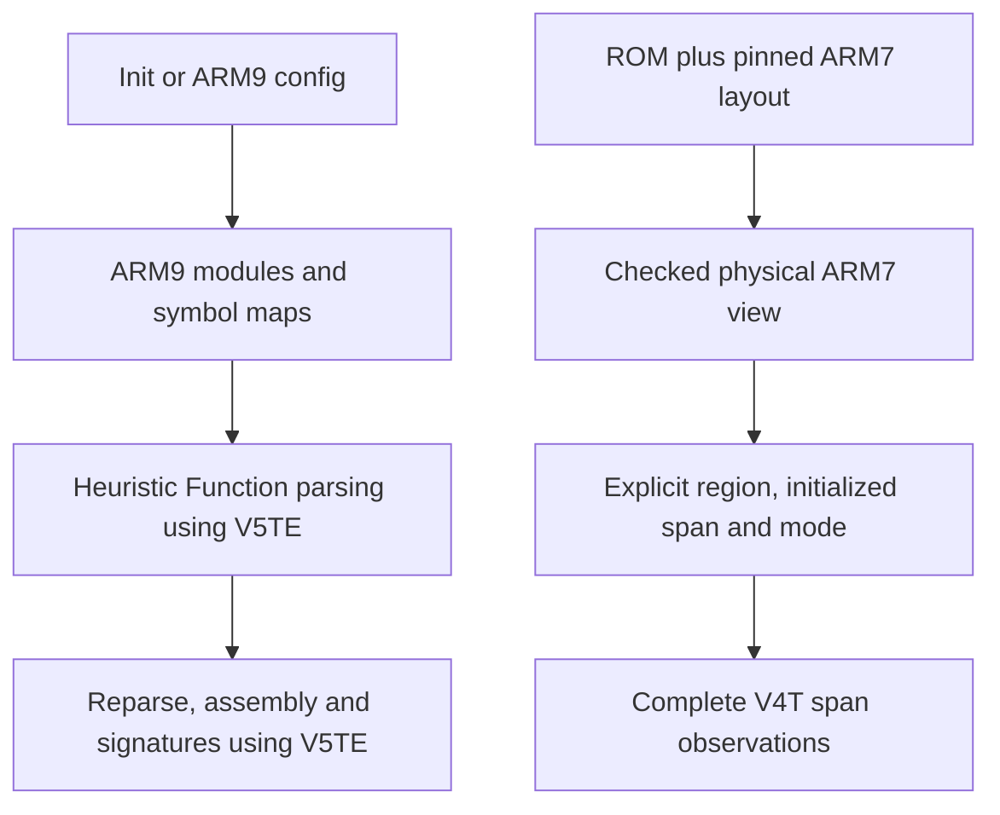

# ARM7 analysis grounding

Inspected tool source bee60e2ee89308616933a391c387928e2dfb5c07.
Graph project ds-decomp-t10-pin covers unchanged analyzer sources. New checked
ARM7 input code was read directly after indexed discovery was insufficient.

## Existing flow

Init::run selects ARM9, its overlays and autoloads. analyze_arm9 requires
ARM9 constructor, main and exception conventions. find_sections_arm9 uses the
secure prefix, BuildInfo and AutoloadCallback before heuristic function search.
Config::load_module selects only ARM9 module bytes. Program::from_config and
ModuleKind cannot distinguish CPU or parent/child program identity.

FunctionParseOptions supplies a byte slice, base/start/end, existing functions
and optional known_end_address. ParseFunctionOptions supplies ARM/Thumb mode.
Neither carries ISA or CPU. parse_function and its nested helpers use V5TE.
Stored Function keeps mode but no ISA. Function::parser, CLI assembly emission
and signatures all reconstruct V5TE parsers. Register defs/uses includes
Default flags, which remain V5TE when V4T and V5TE features are enabled.

Plain B destinations are checked against 01ff8000..03000000, rejecting the
known ARM7 autoload0 address 037f8468. BL/BLX do not use this guard. BX targets
and numeric jump-table labels are not validated by it. Existing discovery is
linear with literal pools and compiler-pattern heuristics, not a general CFG.

known_end_address overrides the final reported extent after discovery; it
does not bound iteration. Module end can include BSS while bytes contain only
initialized data. Candidate entry subtraction/slicing is unchecked. Iterator
exhaustion does not establish complete Thumb BL consumption.

## Checked ARM7 boundary

Arm7Layout::checked validates parent/program hashes, selector, layout and RAM
ranges. Arm7View::module_inputs yields immutable startup and ordered autoload
regions, distinct initialized/BSS ranges and full program/CPU/region identity.
Arm7ModuleInput::decode_span takes explicit mode and initialized byte span,
uses fixed little-endian V4T, and rejects partial/illegal decoding atomically.
Its returned descriptive policy copy cannot change internal decoding.

This establishes physical ownership and decodability. It does not establish
functions, section classification, symbols, original relocations or linkage.
The header entry was validated but is not retained/exposed by Arm7View or
Arm7ModuleInput. Do not substitute later mutable layout metadata as authority.

## Evidence and limits

Startup 02380000..02380008 and autoload0 037f8468..037f8470 are grounded short
ARM instruction spans. They are not complete function extents. Autoload1 mode
and executable extent are unknown. Parent and child ARM7 payloads happen to be
identical but their full program identities remain distinct. External startup
RAM targets have unresolved byte ownership. Never infer executable ownership
from initialized mapping or BSS alone.

The initial deliverable must expose bounded, explicit-mode analysis with
preserved V4T/full identity and declared address context. It must not fabricate
Module/Config metadata or imply ARM7 source/link baseline credit. Existing
ARM9 callers must retain explicit V5TE behavior.

## Source references

- lib/src/analysis/functions.rs:39,64,217,591,683,714,934,962,1108,1132,1299,1312,1512
- lib/src/analysis/function_start.rs:189
- lib/src/analysis/function_branch.rs:6
- lib/src/analysis/illegal_code.rs:19
- lib/src/analysis/jump_table.rs:580
- lib/src/config/module.rs:134,225,470,808,1184,1402,1428
- lib/src/config/config.rs:99
- lib/src/rom/rom.rs:29
- lib/src/rom/arm7.rs:116,198,213,272
- lib/src/rom/arm7_modules.rs:38,78,103
- cli/src/cmd/init.rs:57
- cli/src/config/program.rs:17,45,79
- cli/src/analysis/functions.rs:35
- cli/src/analysis/signature.rs:79

Read-only explorers: rom_inventory traced Function/parser/control flow;
intake_contract traced Module/Config/Init and byte ownership. No source edits
or new execution proofs were produced in this grounding phase.

## Grounding synthesis

The how explainer reconciled both slices at bee60e2. Physical ownership and
function analysis are separate systems. The existing ARM9 path loses target
identity before discovery and reconstructs V5TE downstream. A first ARM7
operation can produce bounded control-flow observations and explicit diagnostics
without entering ARM9 Module/Config or asserting real function extents.

Authority gaps remain checked entry retention, target executable/mode evidence,
and unmapped external RAM byte ownership. This is factual grounding, not a
candidate selection. No files in tool source were changed by the explorers.
