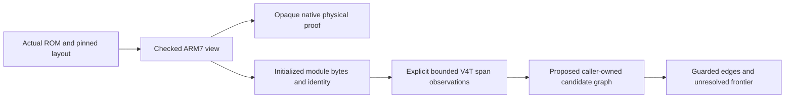

# ARM7 candidate reachability boundary

The smallest next operation joins caller-selected span observations into a
candidate graph rooted at explicit, evidence-bearing addresses. It follows an
edge only to an instruction start already decoded in the same program and mode.
It reports every other edge as a frontier. This can establish graph reachability
under stated root and edge assumptions, without asserting that the processor
executes a path, that a span is a function, or that initialized bytes are code.

This is architect grounding only. Sketch, arena, implementation, and acceptance
remain future work. The inspected DSD checkout is
`7b3513f05adc88a1cca8b0365d3a3607a50a1b25`. Graph search in
`ds-decomp-t10-pin` found two unrelated `arm7_bios` fields and no relevant ARM7
implementation nodes, so the initial trace used the actual source files.
The graph was then refreshed. Future discovery uses project
`ds-decomp-arm7-physical-7b3513f`, where `observe`, `decode_span`, and
`Arm7View.checked_envelope` now resolve to the inspected source. The checked
entry accessor also reads successfully through `get_code_snippet`.
For the separate canonical Python verifier, project `JUSDecomp-verification`
indexes the current `tools/scripts` tree, including `build_child`,
`merge_snapshot`, and `recheck_child`. The broad `JUSDecomp` index filters that
directory; its absence there is not evidence that those functions are missing.

## The checked input and observer boundary

`Arm7Layout::checked` in `lib/src/rom/arm7.rs:216` selects the exact parent or
NitroFS program. It validates program identity, header, stored image, parameters,
loader table, region hashes, physical coverage, and runtime initialized/BSS
bounds. Equal parent and child ARM7 payloads do not merge their identities.
The accepted native physical baseline consumes this view and proves opaque
payload and layout preservation. Its receipt leaves executability, original
functions, and original relocations unknown.

`Arm7View::module_inputs` in `lib/src/rom/arm7_modules.rs:47` supplies startup and
ordered autoload modules, excluding the table. Each input retains full program,
CPU, and region identity with separate initialized bytes and BSS. `decode_span`
at line 103 accepts a caller's bounded range and explicit mode. It uses
little-endian V4T, checks alignment and initialized bounds, and rejects illegal
or incomplete decoding atomically. It does not discover a range to decode.

`observe` in `lib/src/analysis/arm7_observation.rs:127` first checks the source's
membership and rejects foreign program context and overlapping mappings. It
uses that decoder, retains instruction starts and lengths, and emits guarded
transfers. Direct B and BL destinations come from validated raw encodings.
Numeric targets have initialized, BSS, or unresolved byte ownership. Their
boundary classification refers only to this selected span, so an address marked
`outside_selection` may be the first instruction of another supplied observation.
No destination causes another decode.

The previous [grounding](arm7-observation-design/grounding.md) says the checked
view does not retain entry metadata. That statement is stale at the inspected
revision. `CheckedArm7Envelope` at `arm7.rs:116` retains the checked header entry;
`checked_envelope()` exposes it within the crate. Public `Arm7ModuleInput` still
exposes no entry authority. A future root accessor can use this checked value.
Rereading the mutable layout sidecar would discard that protection.



## What a candidate graph may claim

Its inputs are checked modules, complete observations, and explicit roots with
program identity, address, mode, and the evidence for selecting them. The output
retains those facts, per-instruction provenance, guarded edges, and reasons for
stopping. It exposes no `Function`, function-end field, source symbol, relocation,
section classification, or executable-coverage counter.

The graph can split observations at roots, observed branch destinations, and
control transfers. Its block ranges are grouping results inside selected bytes,
not inferred function extents. A destination inside an existing instruction is
a conflict. Conflicting mode interpretations remain unresolved. Duplicate,
overlapping, foreign-program, or missing-source inputs cannot be silently merged.
One program's identical bytes cannot authorize the other's graph.

The caller owns expansion. An initialized target outside every supplied
observation remains a frontier until the caller supplies a separately bounded,
explicit-mode selection and its evidence. BSS and unmapped targets are never
decoded. Selection exhaustion and traversal limits are explicit stops, never
function ends. Cycles need a visited set and a finite work limit; no path must
be expanded until a guessed return instruction appears.

| Observed transfer | Candidate treatment |
| --- | --- |
| Unconditional B | End this block; consider its direct same-mode destination. No sequential successor. |
| Conditional B | Retain taken and not-taken guards separately. Neither establishes the actual outcome. |
| BL | End this block at the call. Record the callee edge and a separate continuation guarded by call return. |
| Conditional BL | Keep the taken-call, taken-and-returned continuation, and condition-failed fallthrough distinct. |
| BX, any other PC write, or exception | Preserve the unknown destination and mode. Conditional forms retain only the observer's guarded not-taken fallthrough. |
| Ordinary instruction | Retain the observer's sequential edge inside a selected interpretation. This does not prove memory accesses or execution are safe. |

A `BX lr`, `mov pc, lr`, or PC load is not automatically a proven return. Register
values, stack contents, exception state, and exchange mode can be unresolved.
The observer intentionally lacks register-value propagation. The known startup
literal load and `BX r1` can justify selecting a separate ARM seed at
`0x037f8468`; they do not turn all indirect transfers into known edges.

Literal loads establish a use of specific bytes at a specific instruction site.
They do not assign ownership of a whole pool or function. Startup's `BX` at
`0x023800c8` is followed by words that LLVM can decode as ARM instructions even
though nearby words serve observed literal loads. Linear decode past that
transfer would therefore manufacture apparent code from data-compatible bytes.
A branch that skips bytes likewise does not classify the skipped bytes as data.

## Minimal independently checkable next fixture

The accepted [observer proof](arm7-observation-root-proof.json) already records
ARM span `[0x037f8468,0x037f8470)` and its direct call at `0x037f846c` to
`0x037fcecc`. The smallest new real selection is ARM
`[0x037fcecc,0x037fced8)`, twelve bytes in autoload0. Its SHA256 is
`5a6fe96bf45550d5477d561aaad72ecd879d8123fc517097c611768598256335`.
The checked loader mapping puts it at stored-image offset `0x507c`, derived
from autoload0's stored start `0x1b0` plus runtime offset `0x4ecc`.

The three original little-endian words are `0xe92d4000`, `0xe24dd004`, and
`0xeb000054`. The expected four transfers are:

| Source | Kind and guard | Target in ARM mode | Selection boundary |
| --- | --- | --- | --- |
| `0x037fcecc` | fallthrough, always | `0x037fced0` | instruction start |
| `0x037fced0` | fallthrough, always | `0x037fced4` | instruction start |
| `0x037fced4` | call, always | `0x037fd02c` | outside selection |
| `0x037fced4` | call continuation, call returned | `0x037fced8` | outside selection |

All four targets map to the same program's initialized autoload0 bytes, without
an executability claim. Those words independently decode as a stack save, stack
adjustment, and BL at
`0x037fced4`. Raw signed ARM branch arithmetic gives destination `0x037fd02c`.
The guarded return continuation is `0x037fced8`. Both destinations remain outside
this selection. Connecting the existing call edge to this new selected start
exercises cross-selection ownership without guessing an end or recursively
claiming either next destination. Repeat the fixture separately for both exact
program identities, even though the selected byte digests match.

The concrete caller is a bounded research probe starting from the already
selected `0x037f8468` ARM seed. Joining the observations supplies an auditable
candidate path from that root through call site `0x037f846c`, the selected
instructions at `0x037fcecc`, and call site `0x037fced4` to frontier `0x037fd02c`.
That identifies the next candidate callee address and its original caller chain
for subsequent independent function mapping. A detached twelve-byte record
cannot itself establish that root-relative chain or reject cross-program joins.
The graph still contributes no function count or original function boundary.

This grounding checked those bytes against the pinned original ROM and both
checked-layout image digests. LLVM `llvm-mc --disassemble
--triple=armv4t-none-eabi` and independent raw branch-field arithmetic agree.
A fresh read-only run of the accepted observer binary SHA256
`222350b406018ed60e784deb0c1cbab9760a164b867deab369b98599ad4cf0bb`
reports three instructions and four transfers for the new span in each program.
The observer, module-input, and probe sources are byte-identical between that
accepted observer revision and the inspected DSD revision.

The same bounded run checked the startup loop in `[0x02380000,0x0238002c)`.
Its BLT at `0x02380028` targets `0x02380020`; the other edge reaches the selection
limit `0x0238002c`. It also checked `[0x023800c0,0x023800cc)`: the observer keeps
`BX r1` unknown despite the independently read literal at `0x023800f8` containing
`0x037f8468`. These are useful second fixtures for a cycle, a boundary stop, and
an unresolved exchange. The runs do not prove complete startup reachability.

Local ignored observations are in `build/reachable-grounding/observations.json`,
SHA256 `694228421e131c7c390c57963f36812be7eb2f0cd60287e0d3a3a22dbb209167`.
The selected-span manifest SHA256 is
`4a8ce8f26c7189e5e4951c24bc5571d030d34688a64446b979dc82f183805299`.
Only this metadata document is committed. No ROM or extracted binary file is
committed.

The inspected source is `/private/tmp/jus-arm7-physical-baseline-dsd` at the
revision above. The reused observer source checkout is
`/private/tmp/jus-arm7-analysis-design-bounded`, and its existing build output is
`/private/tmp/jus-arm7-analysis-design-bounded/target/release/examples/arm7_observation_probe`.
Neither checkout nor its cache was changed. The exact successful probe argv was:

```sh
/private/tmp/jus-arm7-analysis-design-bounded/target/release/examples/arm7_observation_probe \
  /Users/djdjo/Documents/mine/rom/jus.nds \
  /private/tmp/jus-arm7-reachable-contract/decomp/matching-notes/other-cpus/arm7-checked-layouts.json \
  8a518abf785a1c24756d5485ee669f64e304af20a69b0d02a889fb60410d9fcc \
  /private/tmp/jus-arm7-reachable-contract/build/reachable-grounding/spans.json \
  4a8ce8f26c7189e5e4951c24bc5571d030d34688a64446b979dc82f183805299
```

The selected-span JSON is generated from each identity in the pinned layout,
in original layout order, with these four selections in this order:

```python
selections = [
    ('startup', 0x02380000, 0x0238002c),
    ('startup', 0x023800c0, 0x023800cc),
    ({'autoload': 0}, 0x037f8468, 0x037f8470),
    ({'autoload': 0}, 0x037fcecc, 0x037fced8),
]
spans = [dict(program=row['identity'], region=region, mode='Arm',
              extent=dict(start=start, end=end))
         for row in layouts for region, start, end in selections]
# json.dumps(spans, indent=2) + '\n' reproduces the pinned manifest bytes.
```

Before implementing the graph, invented fixtures need to distinguish a selected
instruction start from a Thumb BL interior, keep call-return guards, stop at
indirect PC writes, terminate cycles, preserve mode conflicts, and reject equal
bytes under a foreign program identity. The actual twelve-byte fixture then
checks the selected implementation against independent instruction evidence.

## Narrow literal exchange alternative

A separate bounded recognizer could record the operand value and checked target
ownership for an AL PC-relative literal load followed by an AL `BX` using the
same register. It would require exact instruction bytes, a complete checked
four-byte literal read, no intervening clobber, checked address arithmetic, and
explicit ARM/Thumb alignment checks. Such evidence can justify a candidate
exchange target without claiming that the path executes or ends a function.

The actual startup words are `0xe59f1030`, `0xe59fe030`, `0xe12fff11` at
`0x023800c0`, `0x023800c4`, `0x023800c8`. The first load reads `r1` from
`0x023800f8`, whose word is `0x037f8468`. The middle instruction loads `lr`, so a
strict adjacent load/BX recognizer would not cover this real case. A separately
proved exact three-instruction pattern could cover it without general constant
propagation. The same candidate must still retain the unknown execution and
function-extent fields; an operand value is not an execution trace.

This alternative addresses the startup exchange frontier more directly than
joining observations, but introduces value-flow and literal-read policy absent
from the accepted observer. The smaller first step is the selected-span join,
which uses existing getters and needs no new instruction semantics. A later
literal recognizer can attach evidence at that graph's existing unknown edge.
Neither approach establishes that every earlier startup branch was taken or
that external RAM copy inputs were available.

## Why generic Function integration is premature

`lib/src/analysis/functions.rs:64` fixes V5TE policy. `Function::parser` at line
591 reconstructs that parser; `FunctionParseOptions` does not carry ARM7 program
identity or ISA. The plain-branch guard at line 934 rejects addresses outside
`0x01ff8000..0x03000000`, including autoload0's valid mapped addresses. Its literal
pool, register-value, prologue, epilogue, and tail-branch heuristics attach
function ownership that the current ARM7 evidence cannot support.

`known_end_address` is applied in `into_function` at line 1328 after parsing;
it is not a safe decode bound. The CLI still enters `Module::analyze_arm9` at
`cli/src/cmd/init.rs:82`. Reusing this path would require an ISA, identity,
control-flow, and function-ownership redesign rather than a narrow ARM7 adapter.

## Remaining assumptions and blockers

A selected root means "analyze under this execution assumption," not "runtime
execution was observed." The header startup `0x02380000` and the grounded ARM
seed `0x037f8468` have stronger evidence than arbitrary initialized addresses,
but no complete function extent follows. Full startup propagation would also
need a stated policy for processor-state writes and memory effects. The span
observer alone supplies neither value analysis nor path feasibility.

Startup copies 352 bytes from `0x023fe940` and 32 bytes from `0x023fe904` outside
the stored ARM7 image. Their contents, runtime ownership, and executable status
remain unresolved. Autoload1 has no established entry seed or whole-region mode.
Indirect destinations, return behavior, code/data partitions, original function
boundaries, and original relocations remain open. This contract grants zero ARM7
source credit and does not complete T10. The accepted physical baseline and all
16 files pinned by its approval remain unchanged.

Root independently replays the same pinned observer and span manifest, obtains
the identical complete observation digest, and checks both programs' original
words, literal and signed branch destination. Native LLVM independently decodes
the new twelve bytes. Metadata is retained in
[arm7-reachable-grounding-proof](arm7-reachable-grounding-proof/root-proof.json).
This settles the bounded observation; it grants no function or source credit.
